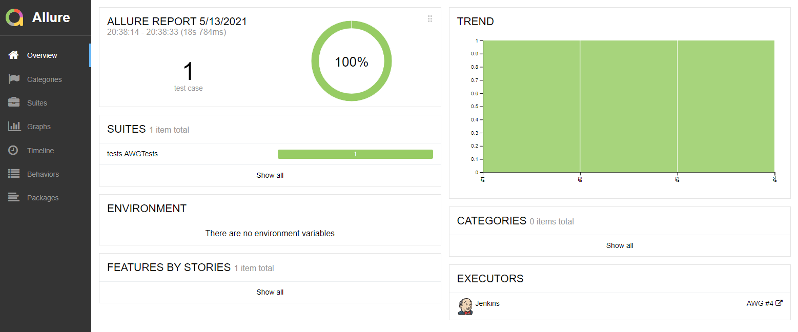
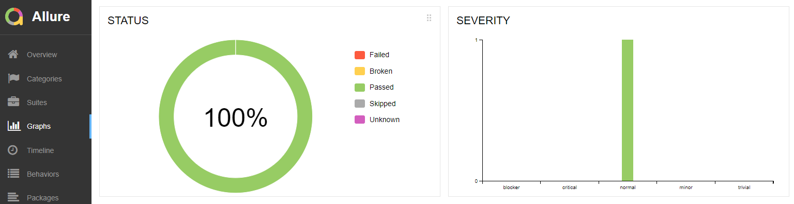
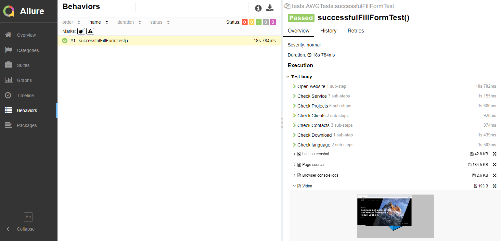

## UI automation testing for https://www.awg.ru

#### *Quick project example with infrastructure: Selenide UI tests with Allure report, remote run on Selenoid and push notifications to Telegram*

### Technology Stack

### Allure report

### Video

### Jenkins
https://jenkins.autotests.cloud/job/AWG/
